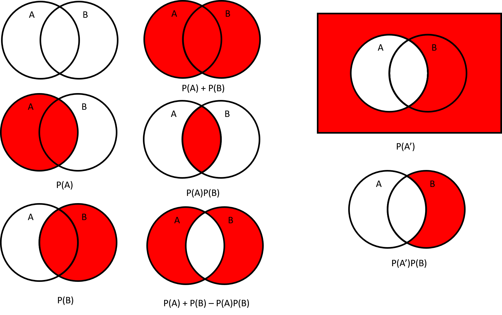

<div class="topnav">
  <a class="active" href="stat5.html">Probability</a>
  <a href="stat5-stat.html">Statistics</a>
</div>

<style type="text/css">
  body{
  font-size: 18pt;
}
</style>

# Probability
We will start with the building blocks of probability.

## Sample Spaces {.tabset}
The sample space $\Omega$ is the set of everything that could happen.
An event $E$ is a thing that can happen.

### Example 1
Flip a coin once. $H$ is the event that the coin is heads. $T$ is the event that the coin is tails.
Then
$$
		\Omega = \{\{H\}, \{T\}, \{H,T\}\}
$$
Notice, the sample space contains every individual event, and every combination of events.
In this case, $\{H,T\}$ represents the event that the coin is either heads **or** tails.
However, when we are writing down the sample space, we usually omit these terms.

### Example 2
Flip a coin twice. $H$ and $T$ represent heads and tails as in example 1.
$$
		\Omega = \{\{HH\}, \{HT\}, \{TH\}, \{TT\}\}
$$
We omit the "**or**" terms for notation.

### Example 3
There are 3 orange balls and 2 white balls in a box. Choose one at random.
$$
		\Omega = \{\{Orange\}, \{White\}\}
$$

## Probability Measure {.tabset}
A probability measure $P: \Omega \to [0,1]$ is a function from the sample space $\Omega$ to a number between 0 and 1.

* $P(\Omega) = 1$  
* For events $A,B$ in $\Omega$, $P(\{A,B\}) = P(A)+P(B)-P(A\text{ and }B)$

We can think of probability as the *Size* of an event in the sample space.

### Example 1
Flip a coin once. Then,
$$
		P(H) = \frac{1}{2} \quad \quad P(T) = \frac{1}{2}
$$
Each event is half of the sample space.

### Example 2
Flip a coin twice. Then,
$$
		P(HH) = P(HT) = P(TH) = P(TT) = \frac{1}{4}
$$
Each event is a quarter of the sample space.

### Example 3
There are 3 orange balls and 2 black balls in a box.
Choose one at random.
```{r echo=FALSE}
plot(c(1,2,3), c(1,1,1), col='orange')
points(c(1.5,2.5), c(1,1), col='black')
```
$$
		P(Orange) = \frac{3}{5} \quad \quad P(Black) = \frac{2}{5}
$$
Orange occupies $\frac{3}{5}$, while Black occupies $\frac{2}{5}$.

### Theoretical Visual Example

$A'$ in this image is the complement of $A$, it is all events that are not $A$.
Visually, we can see $P(A') = P(\Omega) - P(A) = 1 - P(A)$.

## Conditional Probability  {.tabset}
Sometimes, knowledge about one event can give us knowledge for another event.
The probability of event $E$ given event $F$, written as $E|F$, has probability
$$
		P(E|F) = \frac{P(E \text{ and } F)}{P(F)}
$$
Two events $E,F$ are **Independent** if and only if $P(E|F) = P(E)$ and $P(F|E) = P(F)$.
We only need to check one, these are equivalent statements.
Alternatively, $E,F$ are independent if $P(E\text{ and }F) = P(E)P(F)$.

### Example 1
| Car Ownership | Downtown | Elsewhere in City | Outside City | Total |
| --- | --- | --- | --- | --- |
| Yes | 10 | 15 | 35 | 60 |
| No | 60 | 55 | 25 | 140 |
| Total | 70 | 70 | 60 | 200 |
Then we have
$$
		P(Car Ownership) = \frac{\# Car Owner}{\# Total} = \frac{60}{200}
$$
$$
		P(Downtown) = \frac{\# Downtown}{\# Total} = \frac{70}{200}
$$
$$
\begin{aligned}
		P(CarOwnership | Downtown) &= \frac{P(Car Ownership \text{ and } Downtown)}{P(Downtown)} \\
		&= \frac{\frac{\# (Car Owner \text{ and } Downtown)}{\# Total}}{\frac{\# Downtown}{\# Total}} \\
		&= \frac{\# (Car Owner \text{ and } Downtown)}{\# Downtown} = \frac{10}{70} \\
\end{aligned}
$$

### Example 2 (Independence)
| Car Ownership | Downtown | Elsewhere in City | Outside City | Total |
| --- | --- | --- | --- | --- |
| Yes | 10 | 15 | 35 | 60 |
| No | 60 | 55 | 25 | 140 |
| Total | 70 | 70 | 60 | 200 |
Are Car Ownership and Outside City independent?
We know if they are independent, $P(CarOwnership\text{ and }OutsideCity) = P(CarOwnership)P(OutsideCity)$.
So we calculate these quantities.
$$
		P(CarOwnership\text{ and }OutsideCity) = \frac{\# CarOwner \text{ and } OutsideCity}{\# Total} = \frac{35}{200}
$$
$$
		P(CarOwnership) = \frac{\# Car Owner}{\# Total} = \frac{60}{200}
$$
$$
		P(Downtown) = \frac{\# Downtown}{\# Total} = \frac{70}{200}
$$
We can see that $P(CarOwnership)P(Downtown) \neq P(CarOwnership\text{ and } OutsideCity)$ so they are not independent.

### Example 3 (Mutually Exclusive)
| Car Ownership | Downtown | Elsewhere in City | Outside City | Total |
| --- | --- | --- | --- | --- |
| Yes | 10 | 15 | 35 | 60 |
| No | 60 | 55 | 25 | 140 |
| Total | 70 | 70 | 60 | 200 |
Two events $A,B$ are **Mutually Exclusive** if $P(A,B) = 0$.  
Are Car Ownership and Downtown mutually exclusive? No, there are 10 people in the sample living downtown with a car.  
Are Car Ownership and Not Car Ownership mutually exclusive? Yes. You cannot own and not own a car at the same time.

**NOTE:** Mutually Exclusive events cannot be independent, because $P(A\text{ and }B) = 0$ but $P(A), P(B) > 0$.
We do not consider events with probability 0.


## Random Variables {.tabset}
A random variable $X$ on sample space $\Omega$ is an object which takes a value in $\Omega$.
For each event $\omega \text{ in } \Omega$, $X = \omega$ is an event.

We define random variables by their distribution.
If a random variable $X$ has probability distribution $P(\theta)$, we say
$$
		X \sim P(\theta)
$$
$\theta$ is a **parameter** which controls the probability distribution.

### Nominal Example
Let $X$ be the result of a single coin flip. 
We have
$$
		\Omega = \{H, T\}
$$
and
$$
		P(X=x) = \begin{cases}
		\frac{1}{2} & x = H \\
		\frac{1}{2} & x = T \\
		\end{cases}
$$

### Discrete Example
Let $X$ be the result of a single 6-sided dice roll.
We have
$$
		\Omega = \{1,2,3,4,5,6\}
$$
and
$$
		P(X=x) = \frac{1}{6} \text{  if  } x \text{ in } \{1,2,3,4,5,6\}
$$
We can write
$$
		X \sim Uniform(\Omega)
$$

### Continuous Example
Let $X$ represent the height of a random student in feet.
We have
$$
		\Omega = [0,\infty)
$$
The probability that $X=x$ for any $x$ is 0, as there are infinitely many possible heights.
When we are working with continuous random variables, we only have useful probabilities over ranges.
In this case,
$$
		P(0 < X < 100) = P(0 \leq X \leq 100) = 1
$$
Because every student is between 0 and 100 feet tall.

## Expectation and Variance {.tabset}
The **Expectation** of a random variable is its probability-weighted average.
We can think of it as the *center* of the random variable.  
For a discrete random variable $X$ on sample space $\Omega$, the expectation of $X$ is 
$$
		\mathbb{E}(X) = \sum_{x \text{ in } \Omega}x P(X=x)
$$
For any function $f$ we have 
$$
		\mathbb{E}(f(X)) = \sum_{x \text{ in } \Omega}f(x)P(X=x)
$$
Expectation has very nice properties because it is a *linear* function.
This means for any numbers $a,b$,
$$
		\mathbb{E}(aX+b) = a\mathbb{E}(X)+b
$$
The **Variance** of a random variable is a measure of its spread
$$
		Var(X) = \mathbb{E}(X^2)-\mathbb{E}(X)^2
$$
Variance is not a linear function, but does have a similar property.
$$
		Var(aX+b) = a^2Var(X)
$$

### Discrete Example (Uniform)
Let $X$ be the result of a single 6 sided dice roll.
We have
$$
		\Omega = \{1,2,3,4,5,6\}
$$
and
$$
		X \sim Uniform(\Omega)
$$
So we have Expectation
$$
		\mathbb{E}(X) = \sum_{x=1}^6xP(X=x) = \frac{1}{6}(1+2+3+4+5+6) = 3.5
$$
and variance
$$
\begin{aligned}
		Var(X) &= \mathbb{E}(X^2)-\mathbb{E}(X)^2 \\
		&= \sum_{x=1}^6x^2P(X=x) - 3.5^2 \\
		&= \frac{1}{6}(1+4+9+16+25+36) - 3.5^2 \\
		&\approx `r sum((1:6)^2)/6 - 3.5^2`
\end{aligned}
$$

### Discrete Example (Bernoulli)
Consider a weighted coin flip, and let $X$ be the number of Heads.
Because the coin is weighted, the probability of heads is 0.75.
Then
$$
		\Omega = \{0,1\}
$$
and
$$
		P(X=1) = 0.75 \quad \quad P(X=0) = 0.25
$$
or
$$
		X \sim Bernoulli(0.75)
$$
Now we can write 
$$
		\mathbb{E}(X) = 0.75 \quad \quad Var(X) = 0.75-0.75^2
$$
or in general, for $X \sim Bernoulli(p)$,
$$
		\mathbb{E}(X) = p \quad \quad Var(X) = p(1-p)
$$


### Continuous Example (Normal)
The Normal distribution is an extremely common distribution in the real world, defined by its Expectation and Variance.
Let
$$
		X \sim N(\mu, \sigma^2)
$$
Then $X$ is a random variable with Normal distribution, and
$$
		\mathbb{E}(X) = \mu, \quad \quad Var(X) = \sigma^2
$$
The actual probability density function is
$$
		P(X=x) = \frac{1}{\sqrt{2\pi\sigma^2}}e^{-\frac{(x-\mu)^2}{2\sigma^2}}
$$
The actual probability function will not be tested here, but it may be useful to see.

In this class, we always have $Z \sim N(0,1)$, the *Standard Normal*.
Using the properties for expectation and variance above, we can transform any normal to a standard normal probability.

## Independent Random Variables {.tabset}
Just as events can be independent, so can random variables.
Two random variables $X$ and $Y$ are independent iff
$$
		P(X=x,Y=y) = P(X=x)P(Y=y)
$$
For every possible $x,y$.

Expectation and Variance have some nice properties concerning independent random variables.
Given $X,Y$ are independent random variables,
$$
		\mathbb{E}(X+Y) = \mathbb{E}(X)+\mathbb{E}(Y) \quad \quad Var(X+Y) = Var(X)+Var(Y)
$$

### Discrete Example (Binomial)
Consider 100 weighted coin flips, and let $X$ be the number of heads.
Because the coin is weighted, the probability any one coin flip is heads is 0.75.
$$
		X \sim Binomial(100, 0.75)
$$
with
$$
		P(X=x) = \binom{100}{x}0.75^x0.25^{100-x}
$$

Calculating Expectation and Variance directly would be quite difficult, so we use the independence properties of Expectation and Variance.
We can consider $X_i$ to be the bernoulli random variable concerning the $i$th coin flip.
Then $X = \sum_{i=1}^{100} X_i$, and every $X_i$ is independent.
So,
$$
		\mathbb{E}(X) = \mathbb{E}(\sum_{i=1}^{100}X_i) = \sum_{i=1}^{100}\mathbb{E}(X_i) = 100*0.75 = 75
$$
and
$$
		Var(X) = Var(\sum_{i=1}^{100}X_i) = \sum_{i=1}^{100}Var(X_i) = 100*(0.75)(0.25)
$$
in general for $X \sim Binomial(n,p)$,
$$
		\mathbb{E}(X) = np \quad \quad Var(X) = np(1-p)
$$
